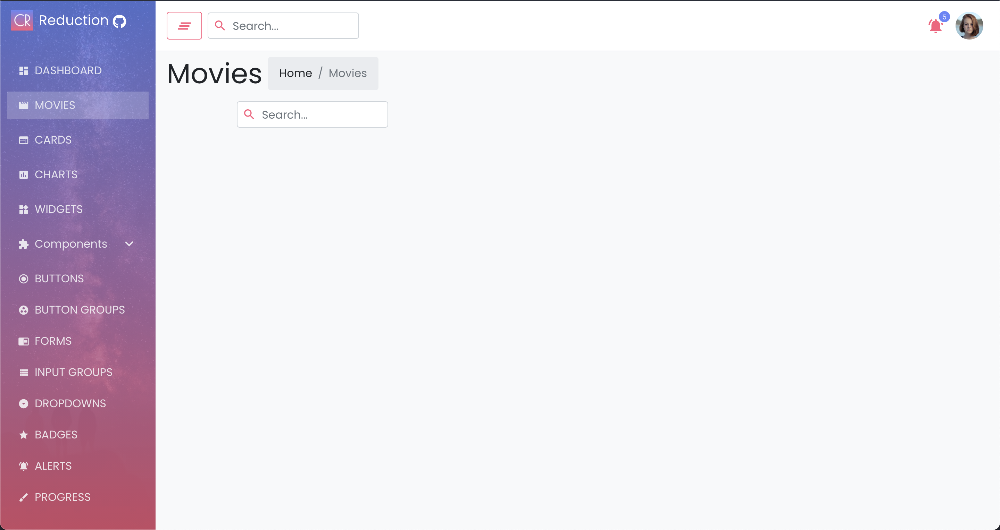
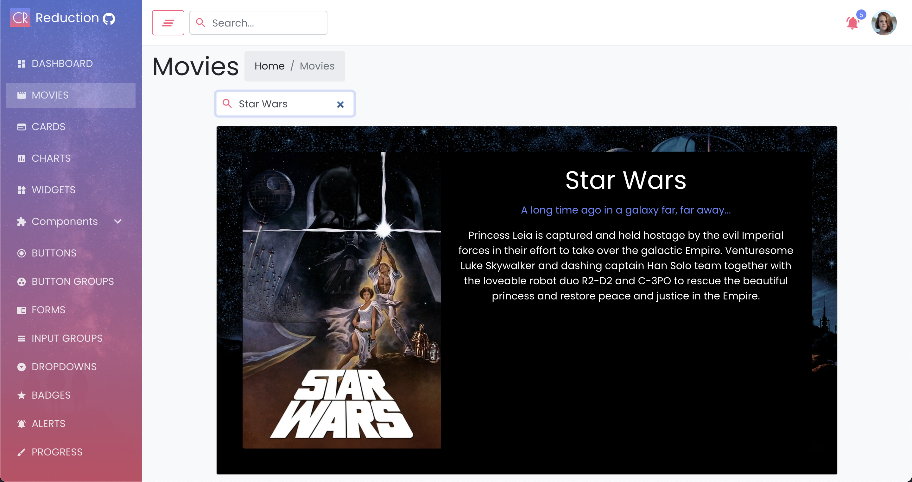
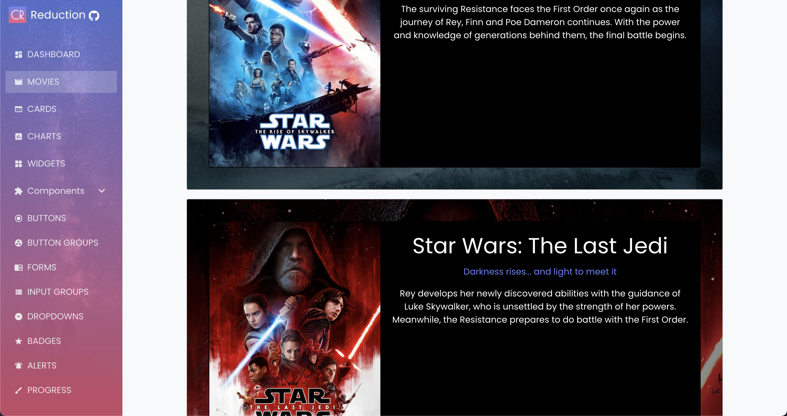
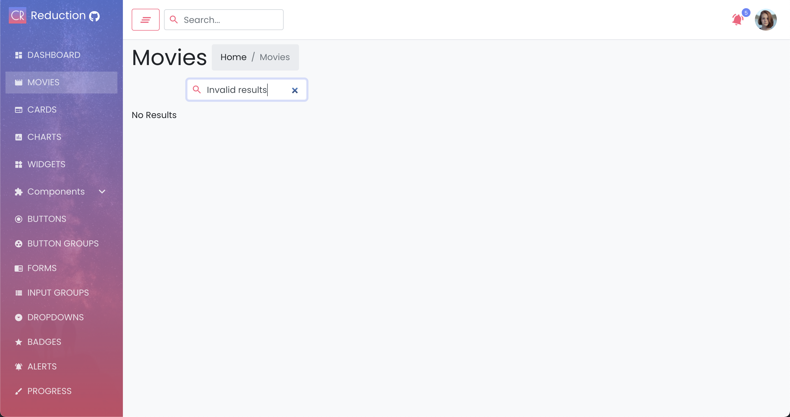

# Coding - Task

Since we do not have an existing code base yet, we use this existing "Admin dashboard template" based on React.

The goal of your task is to create a new page called Movies, where a user can search for movies in the IMDB. The page should contain a search input, where the user can enter the query and on pressing enter all results from the IMDB API should be retrieved and displayed as Cards. Those cards should show the poster and backdrop images, the title, and if available tagline and description. If no results can be found, then show a simple text that no results could be found.

## API Description

### Retrieve Results

`GET https://api.themoviedb.org/3/search/movie?query=%QUERY%&api_key=cfe422613b250f702980a3bbf9e90716`

Searches the API for `%QUERY%` and returns results in the format of:

```
{
    page: 1,
    results: [
        {
            adult: false
            backdrop_path: "/xJHokMbljvjADYdit5fK5VQsXEG.jpg"
            genre_ids: [12, 18, 878]
            id: 157336
            original_language: "en"
            original_title: "Interstellar"
            overview: "The adventures of a group of explorers who make use of a newly discovered wormhole to surpass the limitations on human space travel and conquer the vast distances involved in an interstellar voyage."
            popularity: 102.54
            poster_path: "/gEU2QniE6E77NI6lCU6MxlNBvIx.jpg"
            release_date: "2014-11-05"
            title: "Interstellar"
            video: false
            vote_average: 8.3
            vote_count: 25006
        },
        ...
    ],
    total_pages: 1
    total_results: 17
}
```

### Retrieve Data for specific Movie

`GET https://api.themoviedb.org/3/movie/157336?&api_key=cfe422613b250f702980a3bbf9e90716`

Retrieves data for a movie given by ID (in this example `157336`).

```
{
    adult: false
    backdrop_path: "/xJHokMbljvjADYdit5fK5VQsXEG.jpg"
    belongs_to_collection: null
    budget: 165000000
    genres: [{id: 12, name: "Adventure"}, {id: 18, name: "Drama"}, {id: 878, name: "Science Fiction"}]
    homepage: "http://www.interstellarmovie.net/"
    id: 157336
    imdb_id: "tt0816692"
    original_language: "en"
    original_title: "Interstellar"
    overview: "The adventures of a group of explorers who make use of a newly discovered wormhole to surpass the limitations on human space travel and conquer the vast distances involved in an interstellar voyage."
    popularity: 102.54
    poster_path: "/gEU2QniE6E77NI6lCU6MxlNBvIx.jpg"
    production_companies: [{id: 923, logo_path: "/5UQsZrfbfG2dYJbx8DxfoTr2Bvu.png", name: "Legendary Pictures",…},…]
    production_countries: [{iso_3166_1: "GB", name: "United Kingdom"}, {iso_3166_1: "US", name: "United States of America"}]
    release_date: "2014-11-05"
    revenue: 675120017
    runtime: 169
    spoken_languages: [{english_name: "English", iso_639_1: "en", name: "English"}]
    status: "Released"
    tagline: "Mankind was born on Earth. It was never meant to die here."
    title: "Interstellar"
    video: false
    vote_average: 8.3
    vote_count: 25007
}
```

### Notes

The absolute image paths can be retrieved the following ways

Original Size:

`'https://image.tmdb.org/t/p/original' + relativeUrl` e.g. `https://image.tmdb.org/t/p/original/xJHokMbljvjADYdit5fK5VQsXEG.jpg`

or scaled to 500 pixel width:

`'https://image.tmdb.org/t/p/w500' + relativeUrl` e.g. `https://image.tmdb.org/t/p/w500/xJHokMbljvjADYdit5fK5VQsXEG.jpg`

You can use the API Key `cfe422613b250f702980a3bbf9e90716`

## Screenshots






## Hints

You can reuse everything you can find in this repository, maybe you can also get some inspiration there.

If you reuse the `SearchInput` component you may need to add a prop to react on the `enter` press.

If any question should arise, don't hesitate to ask :) 
